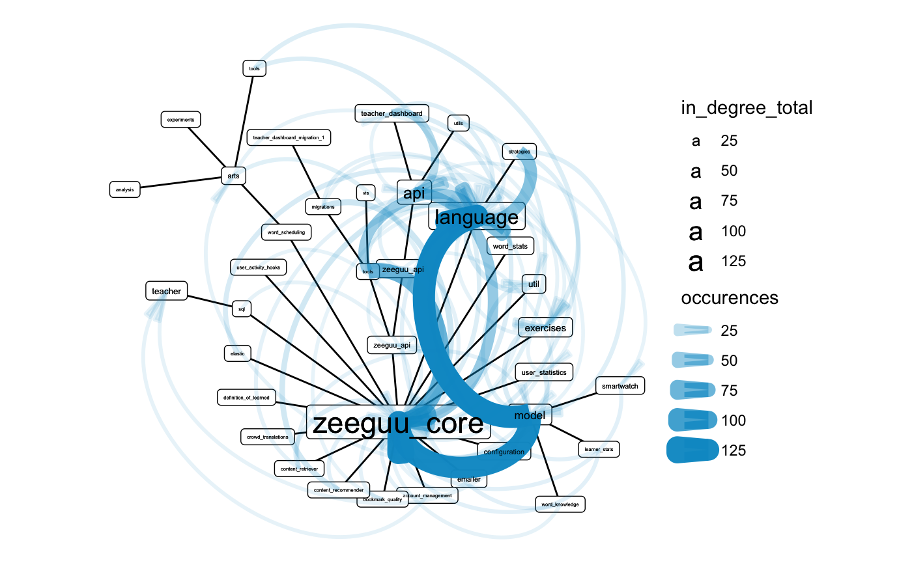

```{r, include = FALSE}
knitr::opts_chunk$set(
  collapse = TRUE,
  comment = "#>"
)
```

## Introduction

### What is in this hand-in?

I chose to submit an automated tool to aid architectural recovery as a hand-in. The full source code and documentation are available on [github](https://benjaminschwetz.github.io/Rchitecture/). For an intro on how to use it, see the last section, **Reproduction**. 

If we look at a software repository as a data source, we have two obvious tree structures, the abstract syntax tree (AST) for script files, and the file hierarchy of the repository as a whole. With `data.tree` and `igraph`, R has two mature packages to handle tree and graph structures. Furthermore, `tidygraph` and `ggraph` are recent packages for graph manipulation and visualization that follow the [tidy data principles](https://cran.r-project.org/web/packages/tidyr/vignettes/tidy-data.html) and [layered grammar of graphic](https://www.tandfonline.com/doi/abs/10.1198/jcgs.2009.07098) for manipulation and visualization of graphs. Last but not least, `reticulate` offers an interface to call python code and convert python objects to R objects. My goal for this project was test whether these packages could be combined to automatically generate insightful architectural views from python repositories. For the visualizations in this report, the file hierarchy was used directly as a graph, while the AST was used only indirectly to construct a dependency graph.


### What is the system?

The Zeeguu-Api repository is used as an example here to demonstrate the tool. From the project website:

> Zeeguu-API is an open API that allows tracking and modeling the progress of a learner in a foreign language with the goal of recommending paths to accelerate vocabulary acquisition. The API is also currently deployed as the backend for the zeeguu.org website.

### What is the problem? 

I would like to find out what internal dependencies exist between modules in the project, i.e. produce a usage-dependency view. Furthermore, I produced some explorative visualizations to get a quick overview on how the repository is structured.


## Methodology

### Tool support: 

I wrote my own scripts and released them under MIT license on [github](https://benjaminschwetz.github.io/Rchitecture/). Beyond the R dependencies that are specified in the `DESCRIPTION` file, I used [maligree/python-ast-explorer](https://github.com/maligree/python-ast-explorer) for parsing python AST into data structures. 

The R packages I rely most on, are:

- 📦`reticulate` for calling those python scripts from R
- 📦`data.tree` for parsing yaml (and directories) into data.tree objects that could then be converted into igraph objects
- 📦`igraph` behind the scenes and for implementations of different graph algorithms
- 📦`tidygraph` for a tidy interface to manipulate the graphs
- 📦`ggraph` for plotting graphs
- 📦`dplyr` for data wrangling


To run the code in this document, you need to load the following packages into your R session: 

```{r setup}
library(Rchitecture)
library(dplyr)
```


### Gathering data

I did a static analysis on the source code from the git repository. The first step was to download the data into a temporary directory:

```{r}
temp_folder <- tempdir()
zeeguu_path <- paste0(temp_folder, "/zeeguu_api")
git2r::clone(url = "https://github.com/zeeguu-ecosystem/Zeeguu-API.git",
             local_path  = zeeguu_path)
```

### Knowlegde Inference

As stated previously, my aim was to develop an automatic tool. Thus, the only knowledge inference I used was that I knew from lectures that it is a python project. As can be seen from the code below, the tool can be used iteratively to fine tuning visualizations based on learnings.

In my case, I realized that html files and the `tests` directory are not architecturally relevant after an initial exploration.  


## Results

### Content table

The `content_table` function generates a table of content from the repository:

> Which file types occur most often and which files take most of the space?

```{r}
folder_contents <- content_table(zeeguu_path, include_folders = FALSE, temp_folder)
```

`dplyr` verbs can then be used to summarize that table:

```{r}
folder_contents %>% 
  mutate(
    file_type = forcats::fct_infreq(file_type)
  ) %>% 
  group_by(file_type) %>% 
  summarise(
    n_files = n_distinct(file_name),
    file_size_sum = sum(size, na.rm = TRUE),
    file_size_median = median(size)
  ) %>% 
  mutate_if(is.numeric,round) %>% 
  knitr::kable()
```
From this table we can see that: 

- it is likely a python project, because of the high number of python files
- using a sql database for storage, beause of the sql scripts
- It is a web applications, since it has a lot of html data.
- The project has a license
- It is using one docker image for the entire repo
- some shell scripts

### Repository structure view

While the table above gives some first indications, we loose most of the structural information through this aggregation. The following visualization aims to complement that. The path hierarchy of the repository is visualized in a circle-pack layout with fill color indicating the file type of the folder contents. First level subfolders are labelled for a better understanding.  

```{r fig.width=7, fig.height=5, fig.retina=2}
visualize_folder_type_and_size(zeeguu_path, path_prefix = temp_folder)
```

This view shows that `Zeeguu_core` and `Zeeguu_api` are the two only pure python folders. `tools` contains the aformentioned sql scripts and most of the html is located in actually just located in the tests. 


To improve the visualizations, we zoom in on the architecturally relevant content, by excluding the tests folder.

```{r fig.width=7, fig.height=5, fig.retina=2}
visualize_folder_type_and_size(zeeguu_path, path_prefix = temp_folder,
                               .ignore_regex = "^zeeguu_api/tests")

```

This view shows that most of the python code is organized in the zeeguu_core and zeeguu_api folders and that those are *pure* python folders with a nesting of up to two more levels of sub-folders.


### Package dependency view

#### Approach

I made a crude tokenizer from the `ast` module and used it to parse all `.py` files in the repository. Then I matched those tokens against the list of folder names in the repository to get a list of tokens that are (likely) dependencies. I then generated a graph, treating these mentions as edges. As it had too many nodes for a meaningful plot, I simplified the graph by aggregating the edges on a folder level. To preserve the weight information, I simply summed up the number of occurrences. I then arranged the nodes using a circular tree layout, based on the path hierarchy and encoded `occurences` in edge width and alpha. To make the plot more readable, I also scaled the nodes proportional to their centrality degree, counting incoming edges. 

#### Outcome

The visualization of the dependencies in the package can be seen below:

```{r eval=FALSE}
internal_dependency_graph(zeeguu_path, temp_folder, .ignore_regex = "^zeeguu_api/tests")
```
{width=100%}

The view cleary shows that `zeeguu_core` and more specifically `model` and `language` are heavily dependet on. One could argue that they were named properly. There is some overplotting occurring but it is still possible to look read dependencies for some of the nodes, i.e. `account_management` depends on the `teacher` module. 

It is interesting that the `tools` module also has some dependencies. Unfortunately, these are not readable due to overplotting.

## Discussion

### Limitations

The tokenizer is *very* crude, I am using the ast tree as is.  Unfortunately, from what I understand about python AST, this means relative paths and pythonian dot annotation ("class.method()") are not resolved as separate tokens. Furthermore, I create an edge if the token is equal to a folder name. This results in false positives if identical names occur several times in the folder hierarchy or some folders names happen to be identical to a string in the python script that is not an import. This limits the information content of the visualizations. Future work should thus focus on improving the tokenizer.

Additionally, some more options to filter the visualizations would be useful enable more iterative use of the package, e.g. allow for the ability to only plot outgoing edges from scripts in the tools directory would enable us to understand how this component relates to the rest of the repository.


## Conclusion

The visualizations give a first impression of the project, answering the following questions:

- What type of files does the repository consist of?
- How are they distributed across subfolders (packages)?
- What are the main dependencies within the project?

## Reproduction

The full source code and documentation are available on [github](https://benjaminschwetz.github.io/Rchitecture/). To use it, you need to have R and python installed on your system, [`reticulate` configured](https://rstudio.github.io/reticulate/), and [remotes](https://cran.r-project.org/web/packages/remotes/remotes.pdf) installed. To use the package run the following command in an R session:

```{r eval=FALSE}
remotes::install_github("benjaminschwetz/Rchitecture")
```

I haven't had the possibility to test it on a Windows machine yet. I suspect that there might be some issues compared to macOS/Linux since this software is relying heavily on parsing absolute file paths as strings


